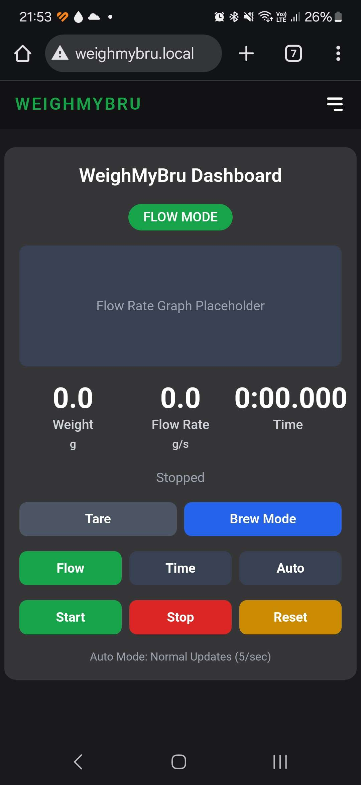

<p align="center">

</p>

<p align="center">  <b>The smart coffee scale that doesn't break the bank!</b></p>
<br>

[](https://discord.gg/HYp4TSEjSf)
[](LICENSE)

This project is a smart coffee scale with a webserver hosted on the ESP32-S3.
This scale was designed to be used in conjunction with GaggiMate, but can also be used as a standalone scale. The project is still in a beta phase and is actively being worked on. Please head over to the [Discord](https://discord.gg/HYp4TSEjSf) server for more info. This scale was inspired by [EspressiScale](https://www.espressiscale.com) but with a non-custom PCB approach. The idea is to be low-cost, easily sourcable scale.

<br>
<br>


## Documentation

The documentation is currently being worked on. 

[WeighMyBru Docs](https://031devstudios.github.io/weighmybru-docs/)

## Features

- Webserver via WiFi
- Bluetooth connectivity to GaggiMate
- Calibration via webserver
- Real-time flowrate display
- Adjustable decimal point readings
- Different modes for to cater for espresso and pour-overs

## GaggiMate

GaggiMate now fully supports WeighMyBru scale.

[GaggiMate](https://github.com/jniebuhr/gaggimate)

## Installation

Installation instructions are currently under development, for now follow the [link](https://031devstudios.github.io/weighmybru-docs/#/installation/flashing) for step-by-step installation instructions.

```
  this project requires VSCode with PlatformIO extension installed
```

## Bill Of Materials (BOM)

| Qty |           Item                | 
| --- | ----------------------------- |  
|  1  | 500g Mini Loadcell (I-shaped) |  
|  1  | HX711                         |
|  1  | ESP32-S3-Supermini Board      |
|  2  | Capacitive Tocuh Pads         |
|  1  | 0.91" SSD1306 OLED Display    |
|  1  | 800mAh Li-ion Battery         |
|  1  | JST-PH 2.0 Male Connector     |
|  1  | Slide Switch                  |
|  1  | Various Wires                 |
|  1  | Various Fasteners             |
