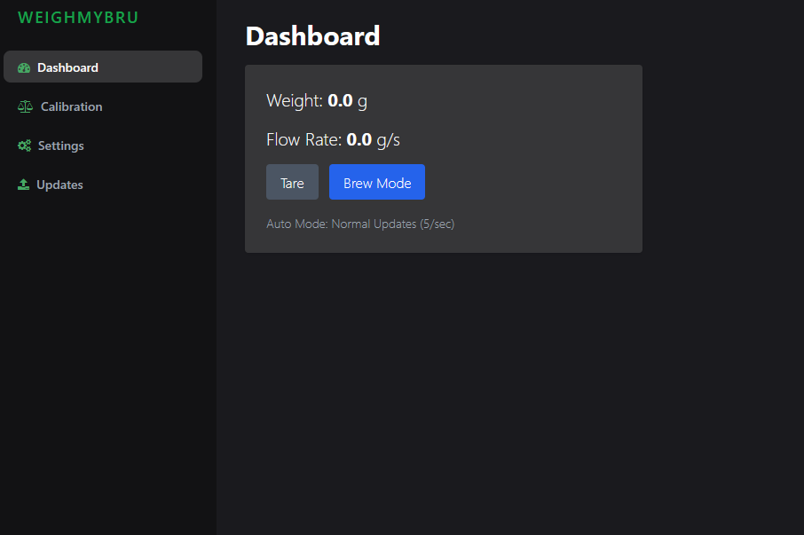

# WeighMyBru²

The smart espresso scale you've been looking for!

This project is a an upgraded version of WeighMyBru headless scale. A SSD1306 display and a tare button have been added.
The 3D printed housing is currently in progress.

